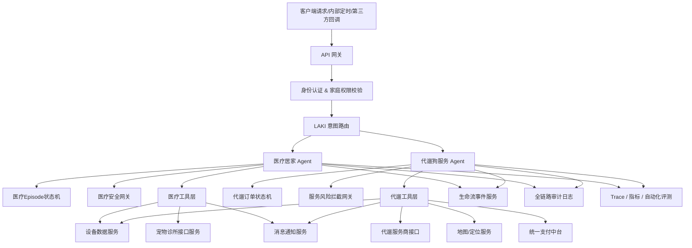
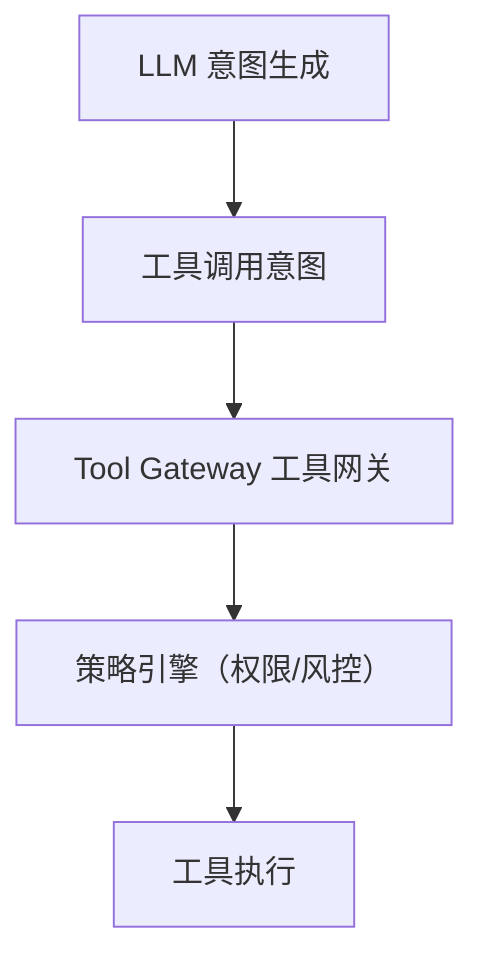
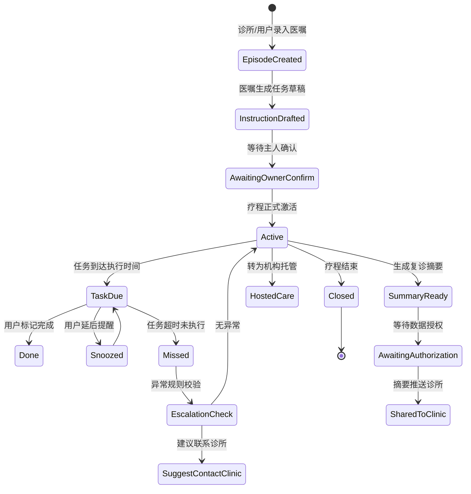
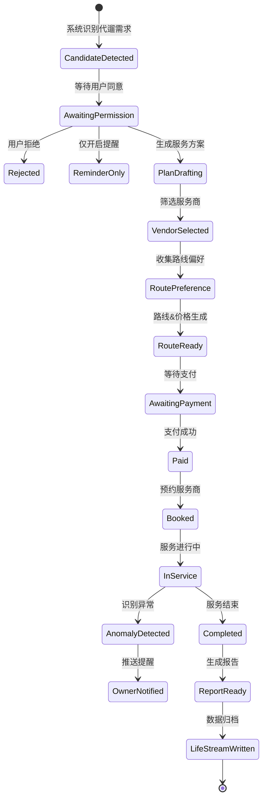
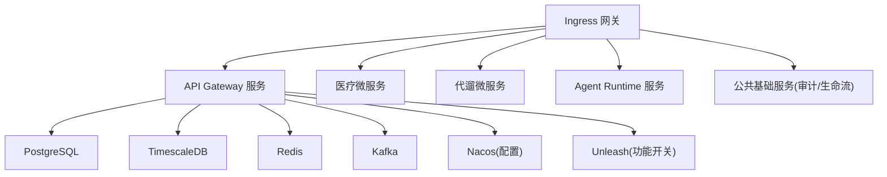

# 01 帕奇宠Agent后端总体架构文档

## 通用强制规则（全局生效）

1. 本文档为最终标准，Ralph-Claude-Code 禁止擅自新增功能、修改流程、删减约束；

2. 所有代码、配置、脚本禁止出现明文密钥、IP、端口、账号等敏感信息；

3. 所有时间字段统一使用 **UTC+8（东八区）** 时间格式：`yyyy-MM-ddTHH:mm:ss+08:00`；

4. 日志输出统一结构化JSON格式，禁止纯文本日志。

## 文档说明

本文为帕奇宠16医疗居家Agent、19代遛狗Agent后端总体架构设计，独立完整，覆盖业务、分层架构、领域模型、状态机、分布式事务、中间件、部署、异常规则等全内容。

## 一、项目概述

### 1.1 业务背景

帕奇宠是面向多宠家庭的智能照护生命流系统，依托智能硬件、AI能力，实现两大核心场景：

- 16号模块（P0高危）：医疗·居家任务，依托诊所医嘱完成护理调度、数据汇总、诊所对接，**禁止AI执行医疗诊断**；

- 19号模块（P1中高危）：代遛狗闭环，自动识别遛狗需求、完成服务商编排、订单支付、履约监控，**禁止AI自动下单、强制营销**。

整体采用 **Go主服务 + Python AI服务** 微服务拆分：Go承载线上核心业务，Python独立承载LLM/RAG/评测等AI能力，服务通信与资源完全隔离。

### 1.2 核心业务主线

`宠物智能设备数据 + 家庭账号体系 + 医疗任务 + 第三方服务`
→ LAKI常驻AI Agent（后端调度）
→ 全量操作、事件、数据沉淀至生命流，形成全链路追溯体系

### 1.3 Agent核心定位

1. **医疗居家Agent**：医嘱解析、护理任务调度、设备数据汇总、医疗摘要生成、授权管理、诊所对接，仅做辅助执行，不参与医疗决策；

2. **代遛狗Agent**：遛狗需求识别、服务商筛选、路线规划、订单履约、服务报告生成，仅做流程编排，不干预用户消费决策。

## 二、总体设计原则

### 2.1 业务设计原则

1. 生命流优先：所有Agent操作、异常、执行结果必须写入生命流事件服务；

2. 事件触发优先：以定时任务、设备上报、接口事件驱动流程，弱化闲聊对话；

3. 用户确认优先：医疗数据外发、下单、支付、第三方预约，必须校验用户手动确认状态；

4. 专业边界优先：医疗决策归属执业医师，商业决策归属用户，Agent仅承担辅助能力；

5. 可追溯优先：工具调用、授权、支付、数据外发等高危操作全链路审计留痕。

### 2.2 工程设计原则

1. Workflow主导：状态机管控核心业务流转，LLM仅负责内容生成，不控制流程；

2. 工具受控：Agent禁止直连数据库、第三方接口，仅调用注册标准化工具；

3. Default-Deny：新增工具、权限、能力默认禁用，人工审批后方可上线；

4. 能力与权限分离：Agent具备调用能力 ≠ 用户拥有操作权限，双层鉴权校验；

5. 幂等优先：所有写操作、回调接口强制实现幂等设计；

6. 可观测内建：链路追踪、指标监控、告警能力开发阶段同步接入；

7. Eval守底：医疗、支付、隐私红线接入自动化评测，实时拦截违规行为。

## 三、整体架构分层

### 3.1 架构总流程图



### 3.2 模块职责明细

|模块|核心职责|
|---|---|
|API 网关|流量入口、请求校验、限流、IP拦截、路由转发、基础日志|
|身份认证&权限|账号鉴权、家庭/成员角色、数据权限校验|
|LAKI 意图路由|请求分发、Agent优先级管控、冲突处理|
|医疗居家Agent|医嘱解析、任务调度、摘要、授权、诊所对接|
|代遛狗服务Agent|需求识别、服务商、订单、监控、报告|
|安全网关|拦截LLM违规输出、业务风险行为|
|工具层|统一封装数据、第三方调用能力|
|生命流服务|全事件存储、页面渲染数据提供|
|审计服务|高危操作全链路日志留存|
|观测中心|链路追踪、指标监控、异常告警、AI评测|

### 3.3 Agent Runtime执行链路

所有Agent工具调用必须遵循固定链路，禁止跳步、自定义流程：



**硬性约束**

1. Agent 禁止直接操作数据库、直连第三方接口；

2. 所有工具调用必须经过工具网关 + 策略引擎双重校验。

### 3.4 全局运行阈值（固定不可修改）

|配置项|数值|
|---|---|
|单次会话最大工具调用数|5|
|工具嵌套最大递归深度|3|
|LLM输入Token上限|8000|
|LLM输出Token上限|1500|

## 四、领域状态机设计

### 4.1 医疗疗程状态机



**状态约束**：状态切换前必须校验当前状态、幂等键、权限，**禁止跨阶跳变**；已关闭/归档的疗程仅支持查询，禁止二次变更状态。

### 4.2 代遛订单状态机



**状态约束**：状态切换前置校验规则同医疗状态；已完成订单标记归档，禁止状态二次变更。

## 五、分布式事务（Saga）设计

### 5.1 适用场景

代订单全流程：`创建订单 → 发起支付 → 预约服务商 → 启动服务 → 服务完成`

### 5.2 正向流程

创建代遛订单 → 发起支付 → 预约服务商 → 启动服务 → 服务完成

### 5.3 异常补偿规则

1. 预约服务商失败：自动原路退款，推送异常事件；

2. 支付回调超时：30s为一轮，最多重试3次，失败则关闭订单并退款；

3. 服务中途中断：状态回滚至「已预约」，生成人工工单；

4. 所有Saga异常必须写入审计日志并触发P1告警。

### 5.4 代码存放目录

所有Saga流程统一存放于 `internal/workflow`

## 六、Memory记忆架构

### 6.1 记忆分层与生命周期

|记忆类型|存储内容|生命周期|存储载体|
|---|---|---|---|
|Session Memory|单次会话临时数据|24小时|Redis|
|Episode Memory|疗程/订单全量数据|流程结束+180天|PostgreSQL|
|Family Memory|家庭长期偏好配置|永久（支持手动删除）|PostgreSQL+Redis|

### 6.2 读写规则

1. 短期会话记忆不跨会话复用；

2. 读取记忆前必须完成权限校验；

3. 数据变更同步写入生命流 + 审计日志；

4. 不同家庭、不同宠物、不同用户的Session记忆**完全物理隔离**，禁止数据互通；

5. 用户主动退出/会话超时，立即销毁对应Session Memory。

## 七、中间件选型

|组件|选型|用途|
|---|---|---|
|关系数据库|PostgreSQL|核心业务数据存储|
|时序数据库|TimescaleDB|宠物轨迹、设备时序数据|
|缓存/分布式锁|Redis|幂等、锁、会话记忆、热点缓存|
|消息队列|Kafka|事件总线、异步解耦|
|定时调度|Quartz / Celery Beat|医疗任务提醒、周期任务|
|权限引擎|Casbin / OPA|权限、风控规则执行|
|配置中心|Nacos|统一配置、阈值、密钥托管|
|功能开关|Unleash|灰度、特性开关|
|可观测|Langfuse+Prometheus+Grafana+Sentry|链路、指标、告警|

### 7.1 定时调度规则

1. 医疗提醒、周期巡检等定时任务，强制使用分布式锁防重复执行；

2. 任务执行超时阈值：10s，超时自动终止并记录告警；

3. 定时任务仅做查询、推送、提醒，禁止修改核心业务数据。

## 八、双服务通信架构

### 8.1 服务划分

1. **Go线上服务**：API网关、业务逻辑、状态机、数据库、中间件、第三方对接；

2. **Python AI服务**：LLM推理、RAG知识库、Prompt管理、AI评测。

### 8.2 通信协议

1. 实时推理（摘要、意图识别）：grpc（低延迟、强类型）；

2. 异步任务（RAG更新、评测上报）：Kafka事件总线。

### 8.3 部署隔离

Go服务部署在线上业务节点，Python AI服务独立部署在离线计算节点，资源物理隔离。

### 8.4 跨服务异常联动规则

1. Go调用Python LLM/RAG服务超时/报错：自动触发LLM降级链路，切换静态模板，不中断主业务；

2. Python消费Kafka任务失败：重试3次，失败转入死信队列并触发P2告警；

3. 双服务网络中断：Go缓存最近有效数据兜底，AI暂停任务，网络恢复后自动续跑。

## 九、部署架构（K8s）



### 9.1 健康检查&优雅停机

1. 所有服务统一暴露 `/health` 健康接口，供K8s探针轮询；

2. 优雅停机：停止接收新请求，等待存量请求完成（最长30s）；

3. 超时未完成则强制退出并触发告警。

## 十、LLM降级与成本控制

### 10.1 多级降级链路

GPT-5 → Claude Sonnet → Gemini → 静态模板
触发条件：LLM超时、接口报错、Token超限、内容违规，逐级降级；**所有降级行为强制记录日志**。

### 10.2 Token预算配置

```YAML
DAILY_TOKEN_BUDGET: 100000
MONTHLY_TOKEN_BUDGET: 2000000
MAX_COST_PER_USER: 5000
```

超阈值触发P2告警，达上限自动切换静态模板。

## 十一、人机介入（HITL）规则

### 11.1 触发条件

1. P0高危风险触发；

2. Agent连续3次工具调用/意图识别失败；

3. 用户发起投诉；

4. 权限校验冲突。

### 11.2 流转规则

触发后暂停自动化流程，生成人工工单（含事件ID、原因、风险等级、关联ID、原始内容）；人工处理完成后，恢复或终止流程。

## 十二、业务伦理强制红线

1. 医疗相关输出**必须附加免责声明**：`以下内容仅基于设备数据观察，不构成医疗建议，请咨询执业宠物医师`；

2. 禁止利用宠物异常状态诱导消费、制造焦虑、使用恐吓类话术；

3. 服务商排序规则完全透明，禁止付费置顶、暗箱加权。
